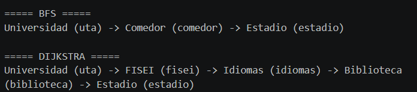
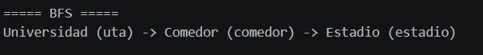
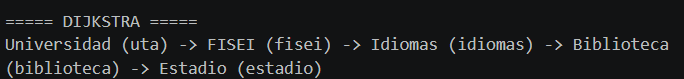

# APE 4 — Grafos: Mapa del Campus UTA

## Estructura de Datos — Universidad Técnica de Ambato

**Integrante:** Nata Analuiza Walter Alexis  
**Nivel:** Tercero "B"  
**Docente:** Ing. Jose Caiza, Mg.

---

## 📌 Descripción del Proyecto

Este proyecto implementa un **grafo no dirigido ponderado** utilizando **lista de adyacencia** para representar las rutas y ubicaciones dentro del **Campus Huachi** de la Universidad Técnica de Ambato.

Se han implementado dos algoritmos fundamentales:
- **BFS (Breadth-First Search):** Encuentra la ruta con el menor número de paradas.
- **Dijkstra:** Encuentra la ruta con la menor distancia total.

---

## 🗺️ Mapa del Campus

| ID | Nombre |
|----|--------|
| uta | Universidad |
| fisei | FISEI |
| idiomas | Idiomas |
| biblioteca | Biblioteca |
| estadio | Estadio |
| comedor | Comedor |

### Conexiones

| Origen | Destino | Peso |
|--------|---------|------|
| uta | fisei | 50 |
| fisei | idiomas | 40 |
| idiomas | biblioteca | 30 |
| biblioteca | estadio | 70 |
| uta | comedor | 20 |
| comedor | estadio | 200 |

---

## 🛠️ Tecnologías

- Java
- Visual Studio Code
- Git Bash
- GitHub

---

## 📁 Estructura

```
Proyecto_APE4/
├── src/
│   └── APE4_Grafos.java
├── captura/
│   ├── ejecucion.png
│   ├── bfs_resultado.png
│   └── dijkstra_resultado.png
└── README.md
```

---

## 🧠 Explicación del Código

### Clase Nodo

```java
static class Nodo {
    String id;
    String nombre;
}
```

Almacena el identificador y nombre de cada ubicación.

### Clase Arista

```java
static class Arista {
    String destino;
    int peso;
}
```

Representa una conexión con su distancia.

### agregarNodo()

```java
public void agregarNodo(String id, String nombre) {
    nodos.put(id, new Nodo(id, nombre));
    adyacencia.put(id, new ArrayList<>());
}
```

Crea un nodo y lo guarda en el grafo.

### agregarArista()

```java
public void agregarArista(String origen, String destino, int peso) {
    adyacencia.get(origen).add(new Arista(destino, peso));
    adyacencia.get(destino).add(new Arista(origen, peso));
}
```

Conecta dos nodos en ambos sentidos.

### BFS

```java
public List<String> bfs(String inicio, String fin) {
    Queue<List<String>> cola = new LinkedList<>();
    Set<String> visitados = new HashSet<>();
    List<String> caminoInicial = new ArrayList<>();
    caminoInicial.add(inicio);
    cola.add(caminoInicial);
    visitados.add(inicio);

    while (!cola.isEmpty()) {
        List<String> camino = cola.poll();
        String actual = camino.get(camino.size() - 1);

        if (actual.equals(fin)) {
            return camino;
        }

        for (Arista arista : adyacencia.get(actual)) {
            if (!visitados.contains(arista.destino)) {
                visitados.add(arista.destino);
                List<String> nuevoCamino = new ArrayList<>(camino);
                nuevoCamino.add(arista.destino);
                cola.add(nuevoCamino);
            }
        }
    }
    return null;
}
```

Explora el grafo por niveles para encontrar la ruta con menos paradas.

### Dijkstra

```java
public List<String> dijkstra(String inicio, String fin) {
    Map<String, Integer> distancias = new HashMap<>();
    Map<String, String> anteriores = new HashMap<>();
    PriorityQueue<String> cola = new PriorityQueue<>(Comparator.comparingInt(distancias::get));

    for (String nodo : nodos.keySet()) {
        distancias.put(nodo, Integer.MAX_VALUE);
    }
    distancias.put(inicio, 0);
    cola.add(inicio);

    while (!cola.isEmpty()) {
        String actual = cola.poll();

        for (Arista arista : adyacencia.get(actual)) {
            int nuevaDistancia = distancias.get(actual) + arista.peso;

            if (nuevaDistancia < distancias.get(arista.destino)) {
                distancias.put(arista.destino, nuevaDistancia);
                anteriores.put(arista.destino, actual);
                cola.add(arista.destino);
            }
        }
    }

    List<String> camino = new ArrayList<>();
    String actual = fin;
    while (actual != null) {
        camino.add(0, actual);
        actual = anteriores.get(actual);
    }
    return camino;
}
```

Calcula la ruta con la menor distancia total usando una cola de prioridad.

### mostrarRuta()

```java
public void mostrarRuta(List<String> ruta) {
    if (ruta == null) {
        System.out.println("No existe ruta");
        return;
    }
    for (int i = 0; i < ruta.size(); i++) {
        String idNodo = ruta.get(i);
        Nodo nodo = nodos.get(idNodo);
        System.out.print(nodo.nombre + " (" + nodo.id + ")");
        if (i < ruta.size() - 1) {
            System.out.print(" -> ");
        }
    }
    System.out.println();
}
```

Imprime la ruta en formato legible.

---

## 🖥️ Compilación y Ejecución

```bash
javac APE4_Grafos.java
java APE4_Grafos
```

### Salida Esperada

```
===== BFS =====
Universidad (uta) -> Comedor (comedor) -> Estadio (estadio)

===== DIJKSTRA =====
Universidad (uta) -> FISEI (fisei) -> Idiomas (idiomas) -> Biblioteca (biblioteca) -> Estadio (estadio)
```

---

## 📸 Capturas

### Ejecución del programa



### Resultado BFS



### Resultado Dijkstra



---

## 📊 Comparación

| Algoritmo | Ruta | Distancia Total |
|-----------|------|-----------------|
| BFS | uta → comedor → estadio | 220 |
| Dijkstra | uta → fisei → idiomas → biblioteca → estadio | 190 |

**BFS:** Menor número de paradas (2).  
**Dijkstra:** Menor distancia total (190).

---

## 🔗 Repositorio

[https://github.com/Alexis112008/ProyectoAPE4](https://github.com/Alexis112008/ProyectoAPE4)

---

## 👨‍💻 Autor

Nata Analuiza Walter Alexis  
Universidad Técnica de Ambato