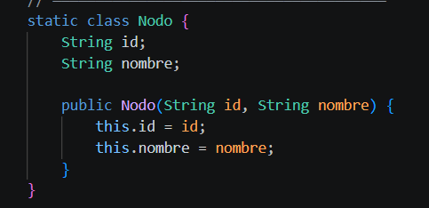
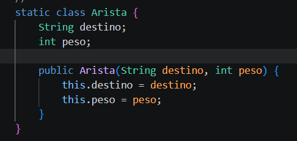
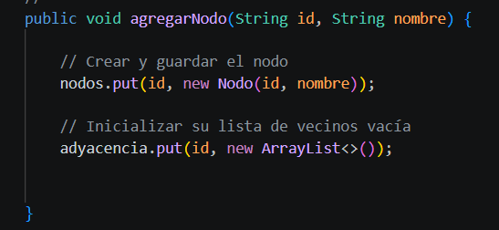
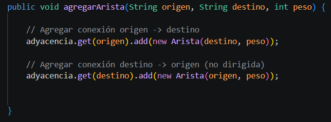
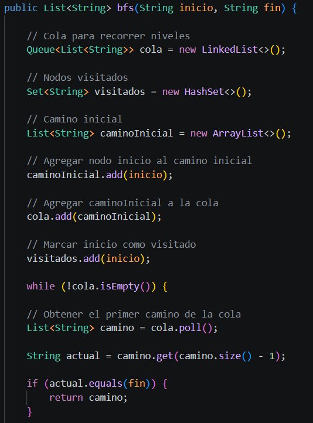
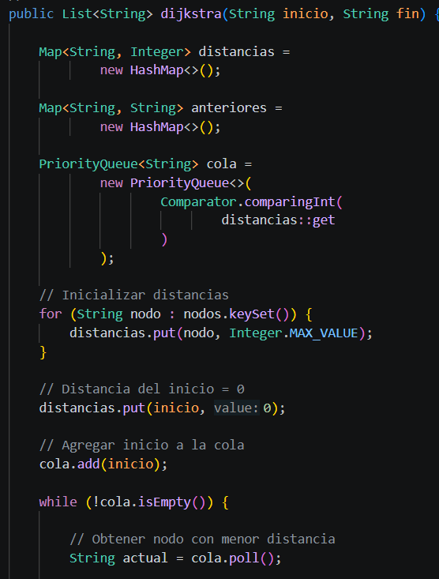
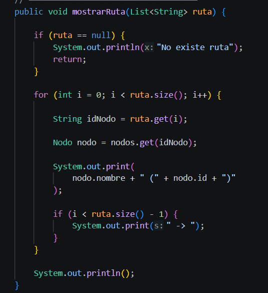

# APE 4 — Grafos: Mapa del Campus UTA

## Estructura de Datos — Universidad Técnica de Ambato

**Integrante:** Nata Analuiza Walter Alexis  
**Nivel:** Tercero "B"  
**Docente:** Ing. Jose Caiza, Mg.

---

## 📌 Descripción del Proyecto

Este proyecto implementa un **grafo no dirigido ponderado** utilizando **lista de adyacencia** para representar las rutas y ubicaciones dentro del **Campus Huachi** de la Universidad Técnica de Ambato.

Se han implementado dos algoritmos fundamentales:
- **BFS (Breadth-First Search):** Encuentra la ruta con el menor número de paradas.
- **Dijkstra:** Encuentra la ruta con la menor distancia total.

---

## 🗺️ Mapa del Campus

| ID | Nombre |
|----|--------|
| uta | Universidad |
| fisei | FISEI |
| idiomas | Idiomas |
| biblioteca | Biblioteca |
| estadio | Estadio |
| comedor | Comedor |

### Conexiones

| Origen | Destino | Peso |
|--------|---------|------|
| uta | fisei | 50 |
| fisei | idiomas | 40 |
| idiomas | biblioteca | 30 |
| biblioteca | estadio | 70 |
| uta | comedor | 20 |
| comedor | estadio | 200 |

---

## 🛠️ Tecnologías

- Java
- Visual Studio Code
- Git Bash
- GitHub

---

## 📁 Estructura

```
Proyecto_APE4/
├── src/
│   └── APE4_Grafos.java
├── captura/
│   ├── ejecucion.png
│   ├── bfs_resultado.png
│   ├── dijkstra_resultado.png
│   ├── codigo_nodo.png
│   ├── codigo_arista.png
│   ├── codigo_agregarNodo.png
│   ├── codigo_agregarArista.png
│   ├── codigo_bfs.png
│   └── codigo_dijkstra.png
└── README.md
```

---

## 🧠 Explicación del Código

### Clase Nodo

Almacena el identificador y nombre de cada ubicación.



---

### Clase Arista

Representa una conexión con su distancia.



---

### agregarNodo()

Crea un nodo y lo guarda en el grafo.



---

### agregarArista()

Conecta dos nodos en ambos sentidos.



---

### BFS

Explora el grafo por niveles para encontrar la ruta con menos paradas.



---

### Dijkstra

Calcula la ruta con la menor distancia total usando una cola de prioridad.



---

### mostrarRuta()

Imprime la ruta en formato legible.



---

## 🖥️ Compilación y Ejecución

```bash
javac APE4_Grafos.java
java APE4_Grafos
```

### Salida Esperada

```
===== BFS =====
Universidad (uta) -> Comedor (comedor) -> Estadio (estadio)

===== DIJKSTRA =====
Universidad (uta) -> FISEI (fisei) -> Idiomas (idiomas) -> Biblioteca (biblioteca) -> Estadio (estadio)
```


---

## 📸 Capturas de Resultados

### Resultado BFS


### Resultado Dijkstra


---

## 📊 Comparación

| Algoritmo | Ruta | Distancia Total |
|-----------|------|-----------------|
| BFS | uta → comedor → estadio | 220 |
| Dijkstra | uta → fisei → idiomas → biblioteca → estadio | 190 |

**BFS:** Menor número de paradas (2).  
**Dijkstra:** Menor distancia total (190).

---

## 🔗 Repositorio

[https://github.com/Alexis112008/ProyectoAPE4](https://github.com/Alexis112008/ProyectoAPE4)

---

## 👨‍💻 Autor

Nata Analuiza Walter Alexis  
Universidad Técnica de Ambato